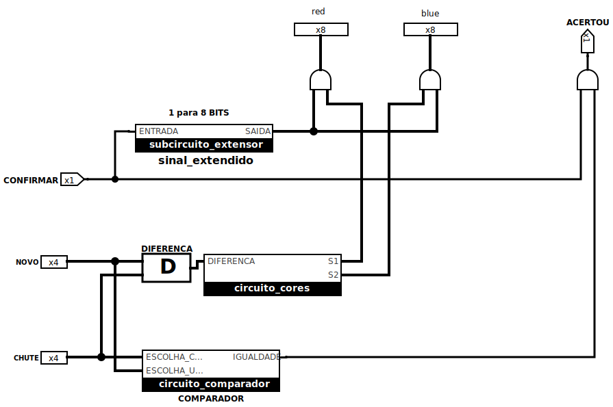
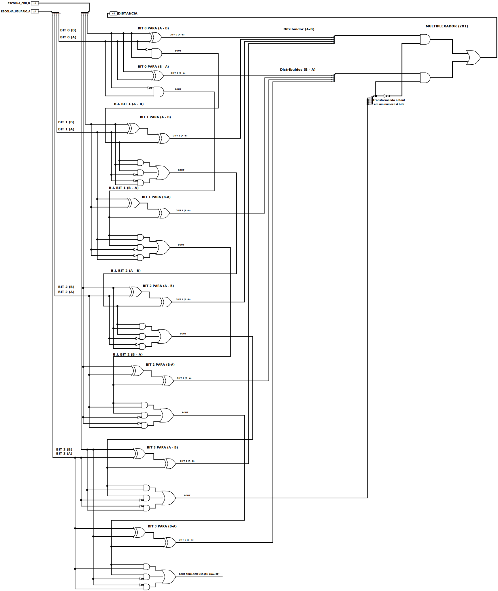
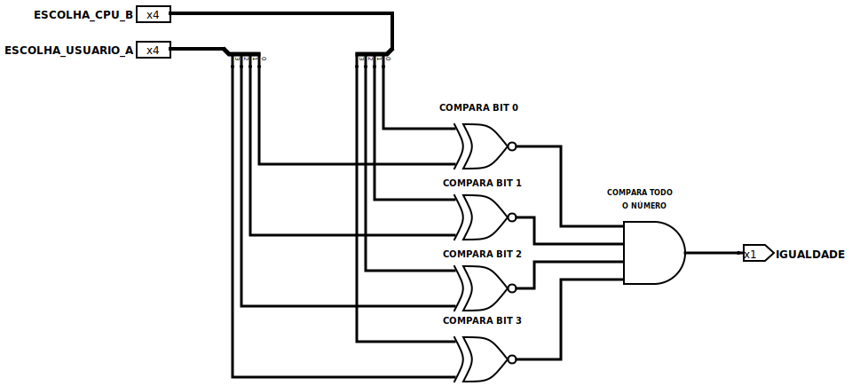
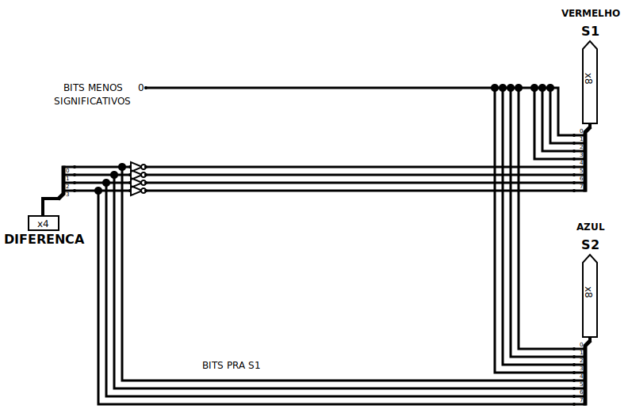

# Projeto: Guess the Number
**Início: 24/05**  
**Disciplina:** Circuitos Digitais | **UFCA** - Universidade Federal do Cariri | **Professor:** Ramon Nepomuceno

## Sobre o projeto
Sistema de **adivinhação de números binários** aleatórios de 4 bits desenvolvido no **Logisim**. O circuito avalia o palpite do jogador, calcula a distância em relação ao valor correto e fornece a distância baseada na intensidade das cores **vermelha** (perto) e **azul** (longe).  

## Visão Geral

  
<a href="#circuito-main">Clique para abrir a visão geral do circuito</a>

   
  

    
  

  ## 📅 Desenvolvimento
| Data | Atividade |
| :--- | :--- |
| 24/05 | Planejamento e organização do projeto|
| 25/05 | Início da implementação do circuito `circuito_diferenca`. |
| 28/05 | Início da implementação do circuito `circuito_comparador`. |
| 07/06 | Implementação do circuito `circuito_cores`. |
| 09/06 | Implementação do subcircuito `subcircuito_extensor`. |

## - Circuitos 3/4...

### I. Circuito "Diferença"

* **Objetivo:** Calcular a distância $|A - B|$ entre o chute do usuário e a resposta.
   
* **Componentes:**  
    * 2 subtratores de 4 bits feitos manualmente, um para A-B, outro para B-A.
    * 1 Multiplexador (MUX) manual 2x1 para seleção do resultado positivo $|A - B|$.
    * 3 pinos: Escolha do Usuário, da CPU e Distância.
        
* **Desafios/Bugs**
   * Implementação manual dos subtratores.
   * Falha na lógica de Borrow-out.
   * Inversão dos BITS no Distribuidor.

  
<a href="#diferenca">Clique para abrir a imagem do Subcircuito Diferenca</a>

   
  
  

 
 

### II. Circuito "Comparador"

* **Objetivo:** Verificar a possível igualdade entre o número A _(chute do usuário)_ e B _(resposta)_.
   
* **Componentes:**
  * 1 Comparador de identidade de 4 bits.
  * 3 pinos: Escolha do Usuário, da CPU e bool da igualdade entre A e B.
        
* **Desafios/Bugs**
    
Nenhum.

  
<a href="#comparador">Clique para abrir a imagem do Subcircuito Comparador</a>

   

  

    
 
 

### III. Circuito "Cores"

* **Objetivo:** Usar a distância calculada para uma representação visual com intensidade diferente no azul ou vermelho, indicando a proximidade do chute.

* **Componentes:**
  * 1 entrada 'distancia' entre o chute e o valor gerado pela CPU.
  * 2 saídas para o controle da intensidade (Vermelho/Azul).

* **Desafios/Bugs**
    
Nenhum.

  
<a href="#comparador">Clique para abrir a imagem do Subcircuito Comparador</a>

   

  

    
 
 

### IV. Decodificador para Display de 7 segmentos (Não iniciado)
